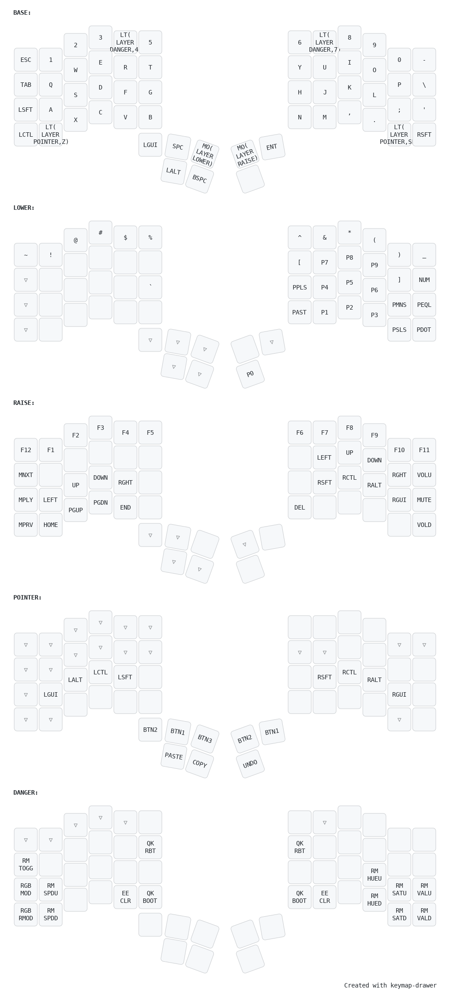

# Charybdis (4x6) `devoid` keymap

The Charydbis (4x6) `devoid` keymap is inspired from the [Charybdis (4x6) vendor](../vendor) keymap, with my own customizations.

## Notable changes

### Active layer indicator lights
Layer mask indicator lights showing active layer keys above base layer(s), custom colors per layer.
The active RGB matrix effect plays undisturbed on the base layer and on transparent keys. No-op keys are dark when active.

### Danger layer
For less used tasks that are possibly disruptive. I kept accidentally tapping the EEPROM CLEAR / QMK BOOTLOADER keys so I moved them out of the way. This also seemed like a good place for RGB cycle keys, trackball DPI cycle buttons, that sort of thing

Requires an intentional reach (hold 4/7 key).

## Layout

